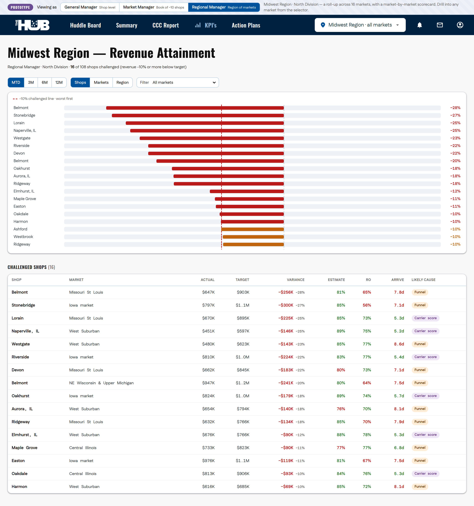

# hub_action_plan_tracker

An **Action Plans** tab for *The Hub* - a self-contained prototype for tracking
**challenged-store remediation** across a Boyd Group / Gerber Collision market. A
Market Manager, CPM, or GM diagnoses *why* a store is missing revenue targets,
builds an action plan, assigns tasks, and tracks whether the intervention actually
moved the metric. Built on The Hub's real navigation shell and design system.

The prototype spans two working tabs - **Action Plans** and a per-store **KPIs**
dashboard - switched from the nav and both driven by the shared store selector.

## Prototype view switcher (roles)

A **Prototype** banner across the top lets you see the same tabs through three roles,
each a wider scope than the last (shop → market → region):

- **General Manager (shop level)** - the default. One shop at a time; the location
  selector picks the shop, and both tabs show just that store.
- **Market Manager (book of ~10 shops)** - scope becomes the manager's book (a
  10-shop *Chicago Metro* market). Action Plans span the whole book, the location
  selector switches to **All my shops** + the book's shops, and the **KPIs tab shows
  the revenue-attainment dashboard** across the book's shops (with the challenged
  list below) - click any shop to open its detail.
- **Regional Manager (a region of markets)** - scope becomes the manager's
  **region**. The full 125-market taxonomy is grouped into **twelve regions**
  under **three divisions**:
  - **North** - Michiana · Midwest · Northeast · Tennessee Valley
  - **South** - Carolinas · Florida · Georgia · Gulf
  - **West** - Great Plains · Northwest · Southwest · Texas

  The demo defaults to the 16-market **Midwest** region (North Division - the
  Chicago-area markets that match the instrumented stores). The location selector
  switches to **All my markets** + the region's markets, and the **KPIs tab shows the
  revenue-attainment dashboard** across every shop in the region, with a Shops /
  Markets / Region granularity toggle and a market filter - click any shop to open its
  detail. The Action Plans board shows the region's active plans. (See the KPIs tab
  section below for the full dashboard → shop detail → carrier scorecard flow.)




## Run it

No build step, no dependencies. Open the page:

```bash
open index.html          # macOS
xdg-open index.html      # Linux
# or drag index.html into any browser
```

State is held **in memory only** - drag, add, edit, and move changes reset on
reload. The board is a snapshot **as of the dataset's reference date** (Aug 10, 2026),
which drives all aging / overdue / behind-target logic.

## What it models

**Five-stage Kanban** - a task moves left to right and does *not* jump straight to
Closed. `Verifying` is deliberate: most remediations lag 30–90 days before the
signal shows up. (`Identified` holds both freshly diagnosed items and planned,
not-yet-started work.)

`Identified → In Progress → Blocked → Verifying → Closed`

**Root-cause taxonomy** (every card is tagged with one):
DRP Scorecard · DRP Participation · Personnel & Training · Equipment · Other.

**Action plan** - **one per shop**, the locked container for getting that shop back
on track. A shop doesn't accumulate many plans; it has one plan with however many
tasks the recovery needs. Open **Aurora, IL** (the default store): its single action
plan holds 15 tasks spanning several root causes - the booth-outage equipment fix,
the cycle-time and CSI scorecard responses, sublet revenue leakage, and a refinish
capacity gap - all under one plan.

**Task** (the kanban card): owner + role, **root cause** (set on the task), carrier
(when carrier-specific), status column, priority, due date, a risk note, a blocked
reason (when Blocked), a **verification signal** (the *name* of the metric expected
to move + expected lag in days), and a dated **activity log** of the real
back-and-forth - each entry stamped with the **date/time and the person** who logged it.
**Status changes are logged automatically**: every time a task moves between columns (by
drag-and-drop or the editor's Status control) a **Status** entry is appended to its
activity log, so the timeline shows how it progressed. In the task
editor the **Action plan is locked** to the shop - a task can't be reassigned to
another shop's plan.

## Using the board

- **Switch stores** from the location selector in the top nav (defaults to
  Aurora; choose **All stores** to see the whole market - one action plan per
  shop across 13 stores).
- **Board or List view.** A **Board / List** toggle switches between the Kanban board
  and a **list view** of the same tasks. The list is a filterable table (Task, Status,
  Owner, Role, Priority, Due, **Activity** count, **Last update** date/time). **Click any
  column header to sort**, click again to flip ascending/descending (the sorted column
  shows an arrow). Each row **drills into its activity log** in place - click a row to
  expand its timeline (status changes and notes, each timestamped and attributed to a
  person), **change the task's status** from an inline dropdown (the move is logged just
  like a drag), **and log a new activity note inline**. Click the pencil to open the full
  task editor.
- **Filters** are **multi-select** (checkbox dropdowns with All / Clear, showing an
  "N of M" count): root cause, **owner**, **owner role**, **insurance carrier** (in both
  views), plus a **status** filter in the list view. Also a **Behind target** toggle
  (tasks past their due date or whose plan blew its target-close date). Market and
  Regional Managers additionally get the store multi-select.
- **Search** across task, owner, store, carrier, diagnosis, and metric.
- **Move or reorder a task** by **drag and drop**: drag a card between columns to
  change its status, or drop it above/below another card to set its position within a
  column. Order is **Manual** by default (drag-defined); the **Sort** menu can switch
  to due date, priority, or plan-opened instead, and the next drag flips it back to
  Manual. You can also open a card and change its **Status** in the task detail view
  (then Save).
- **Click a card** to open it: editable task fields on the left - including the
  **Status** control that moves the task between columns - and the task's
  activity-log timeline (with add-note) on the right.
- **New task** attaches to any plan via the plan picker, and carries its own
  **Root cause** field (defaults to the chosen plan's root cause). When the root cause
  is **DRP Scorecard** or **DRP Participation**, an **Insurance carrier** must be
  selected - the editor marks the field required and blocks save until one is chosen.

> **Data note:** no numeric KPI values, targets, scores, or dollar figures appear
> anywhere - metrics are referenced by name only. All names are synthetic.

## KPIs tab - challenged-shop workflow

Click **KPI's** in the nav. The tab is a focused **dashboard → shop detail →
carrier scorecard** flow answering one question: *is my shop challenged, and if so,
why?* Every threshold, target, and direction lives in **`assets/config.js`** so it
can be changed in one place - and the formatting reads each metric's `direction`
(nothing hardcodes "green above target").

**Primary - revenue attainment.** `revenue_variance_pct = (actual − target) / target`.
A shop is **Challenged** when that is **≤ −10%** (the one place this number lives is
`config.js`).

**Dashboard (landing, for Market & Regional Managers).** One chart: revenue
attainment across the shops in scope, **worst-first, with the −10% line drawn on it**.
Density comes from controls inside the pane - a **period** selector (**3M** - the
default, the trailing three months - **/ 6M / 12M**),
a **market filter**, and a **Shops / Markets / Region** granularity toggle that
re-aggregates within your own scope (a GM sees only their shop). Below the chart, a
**challenged-shop list** carries revenue variance (dollars + %) and the three funnel
metrics as columns, each flagged against its target - plus a **Likely cause** column
that reads **Carrier score** when the funnel is all on-target (so the interesting
carrier-only cases are findable). Click any shop to open its detail.

**Diagnostic - the opportunity funnel** (all denominated on opportunities received):
Opportunity to Estimate (**80%**, higher better), Opportunity to RO (**70%**, higher
better), Opportunity to Arrive (**7 days**, lower better).

**Shop detail.** Revenue attainment (actual vs target, variance) with a titled trend
chart you can **add KPIs to** - plot up to two of Revenue / Opp → Estimate / Opp → RO /
Opp → Arrive at once, and a second y-axis appears on the right when the two use
different units; the three funnel metrics vs target; and the carrier panel below. One
period selector (**3M / 6M / 12M**) drives every trend on the page.

**Carrier scorecard (DRP).** A shop scores separately **per carrier** (0–100; higher
means more volume). Multi-select filters the carriers that actually have volume at the
shop (the top U.S. casualty carriers). Each carrier shows its **score + trend** and the
four contributing variables - **estimate accuracy, rules adherence %, total cycle time,
CSI** - each against the shop's own trailing average, so you can see which variable drags
the score down. **Click a card** to trend any metric over time - score, repair volume,
estimate accuracy, rules adherence %, total cycle time, or CSI - over the same period
windows. The **rules detail** table groups every not-adhered rule by text with counts,
sorted descending - the actionable list behind the adherence rate.

The seed spans a region → market → shop hierarchy (Midwest fully populated, other
regions lighter), with a realistic minority of challenged shops - including a few where
revenue is behind but the funnel is entirely on target, so **the carrier score is the
only remaining explanation.**


## Files

| File | Purpose |
|------|---------|
| `index.html` | Page shell on The Hub's real `ClientLayout` / `thehub` markup, toolbar, board, and the task modal. |
| `assets/hub-shell.css` | The Hub's actual shipped layout/navigation CSS, imported verbatim. |
| `assets/styles.css` | The Hub design tokens + all Action-Plans component styles. |
| `assets/thehub.svg` | The official "THE HUB" logo. |
| `assets/config.js` | **Single source of truth for KPI thresholds** - the −10% challenged line, the three funnel targets **with direction**, and the DRP 0–100 scale (`window.HUB_CONFIG`). |
| `assets/data.js` | The mock dataset - stores (each placed in a market), plans, tasks, cross-links, the Market Manager's book, the twelve **regions** across three **divisions**, and the carrier + rule-text seed for the DRP scorecard (`window.HUB_DATA`). |
| `assets/app.js` | Tab switching, board state, drag & drop, filters, the task modal, and the KPIs workflow - the region → market → shop hierarchy, deterministic per-shop revenue / funnel / carrier generators, the revenue-attainment dashboard, shop detail, and carrier scorecard. |

## How this maps onto the real Hub

The Hub is a Next.js app. To promote this prototype:

1. **Nav entry** - the `Action Plans` `MenuElement` beside `KPI's` is already on the
   real shell; point it at a new route (e.g. `/action-plans`).
2. **Data** - replace `assets/data.js` with the app's data layer / API. The render
   and interaction logic in `assets/app.js` ports to a React component largely as-is.
3. **Store scope** - the nav store selector already drives the board's scope; wire it
   to the app's shop context.

The visual layer uses the app's own tokens (`--color-*`, spacing, corners,
Oswald/Fustat), so it drops in without restyling.
