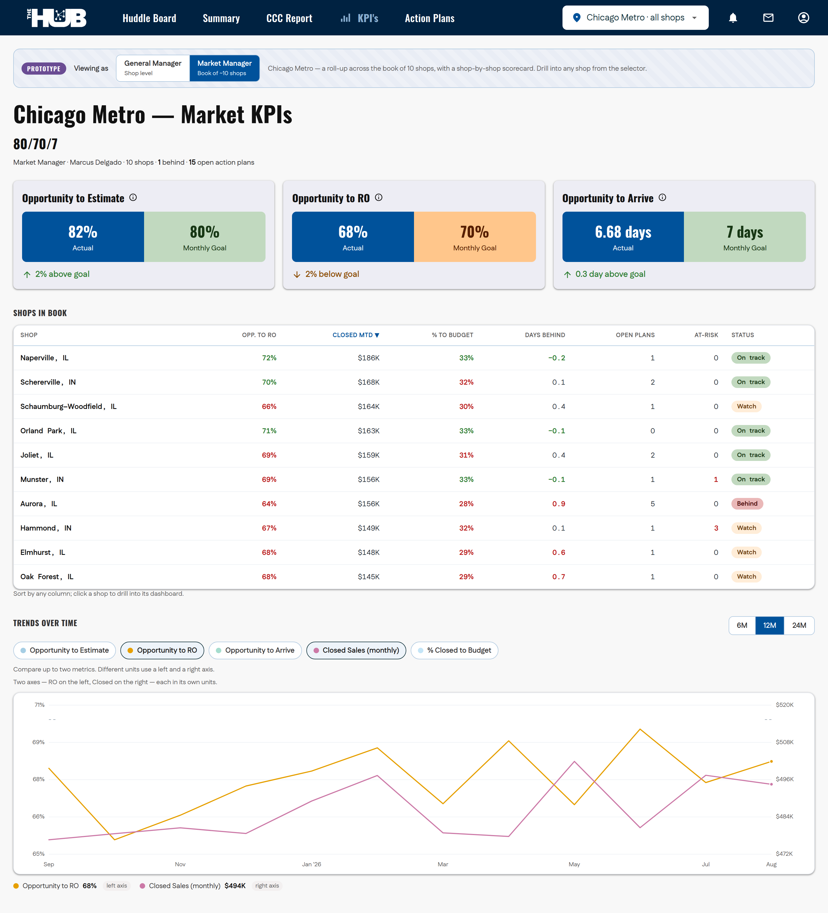
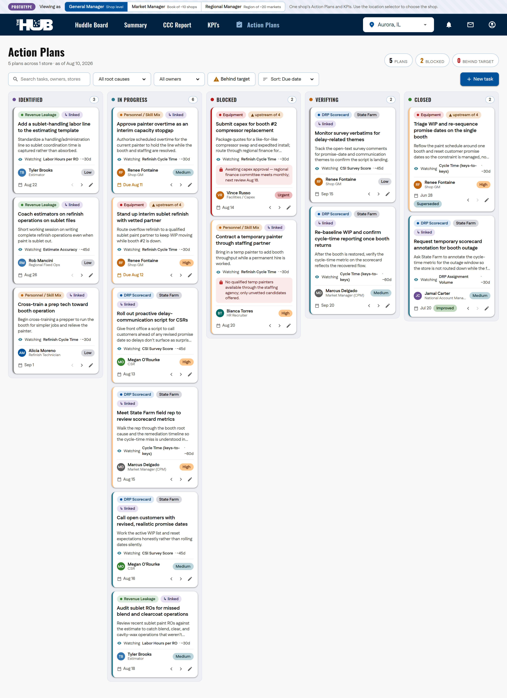
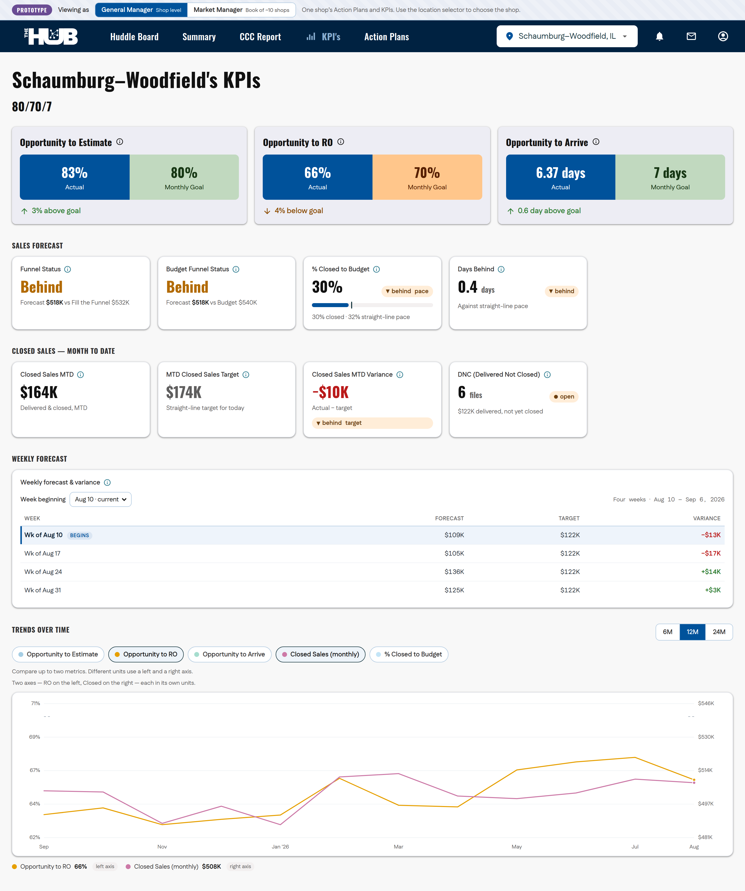

# hub_action_plan_tracker

An **Action Plans** tab for *The Hub* — a self-contained prototype for tracking
**challenged-store remediation** across a Boyd Group / Gerber Collision market. A
Market Manager (CPM) or GM diagnoses *why* a store is missing revenue targets,
builds an action plan, assigns tasks, and tracks whether the intervention actually
moved the metric. Built on The Hub's real navigation shell and design system.

The prototype spans two working tabs — **Action Plans** and a per-store **KPIs**
dashboard — switched from the nav and both driven by the shared store selector.

## Prototype view switcher (roles)

A **Prototype** banner across the top lets you see the same tabs through two roles:

- **General Manager (shop level)** — the default. One shop at a time; the location
  selector picks the shop, and both tabs show just that store.
- **Market Manager (book of ~10 shops)** — scope becomes the manager's book (a
  10-shop *Chicago Metro* market). Action Plans span the whole book, the location
  selector switches to **All my shops** + the book's shops, and the **KPIs tab
  becomes a market roll-up**: a book-average capture funnel, a summary
  (shops behind / open action plans), and a sortable **shop scorecard** (Opp. to RO,
  Closed MTD, % to Budget, Days Behind, open plans, at-risk tasks, and a
  Behind / Watch / On-track status) — click any shop to drill into its dashboard.
  The trends chart rolls up to the book.





## Run it

No build step, no dependencies. Open the page:

```bash
open index.html          # macOS
xdg-open index.html      # Linux
# or drag index.html into any browser
```

State is held **in memory only** — drag, add, edit, and move changes reset on
reload. The board is a snapshot **as of the dataset's reference date** (Aug 10, 2026),
which drives all aging / overdue / behind-target logic.

## What it models

**Five-stage Kanban** — a task moves left to right and does *not* jump straight to
Closed. `Verifying` is deliberate: most remediations lag 30–90 days before the
signal shows up. (`Identified` holds both freshly diagnosed items and planned,
not-yet-started work.)

`Identified → In Progress → Blocked → Verifying → Closed`

**Root-cause taxonomy** (every card is tagged with one):
DRP Scorecard · DRP Participation · Personnel / Skill Mix · Equipment ·
Revenue Leakage · Market Demand.

**Action plan** (attaches to a store): root cause, carrier (when carrier-specific),
opened / target-close dates, owning persona (CPM, RDO, Shop GM, National Account
Manager, RVP, Sales), a plain-language diagnosis, and 3–6 tasks.

**Task**: owner + role, status column, priority, due date, a risk note, a blocked
reason (when Blocked), a **verification signal** (the *name* of the metric expected
to move + expected lag in days), and a dated **activity log** of the real
back-and-forth.

**Cross-linking** — plans carry a `parentPlanId` so several symptoms trace to one
cause. Open **Aurora, IL** (the default store): a single downstream booth outage
(Equipment) shows up as four separate symptom plans — cycle-time and CSI scorecard
misses, sublet revenue leakage, and a refinish capacity gap. Cards show
**▲ upstream of N** on the cause and **↳ linked** on the symptoms.

## Using the board

- **Switch stores** from the location selector in the top nav (defaults to the
  Aurora cross-link cluster; choose **All stores** to see the whole market —
  21 plans across 13 stores).
- **Filters:** root cause, owner, and a **Behind target** toggle (tasks past their
  due date or whose plan blew its target-close date).
- **Search** across task, owner, store, carrier, diagnosis, and metric.
- **Drag** cards between columns, or use the ◀ ▶ buttons.
- **Click a card** to open it: editable task fields on the left; on the right, the
  parent action plan (root cause, carrier, personas, dates, linked plan) and the
  task's activity-log timeline (with add-note).
- **New task** attaches to any plan via the plan picker.

> **Data note:** no numeric KPI values, targets, scores, or dollar figures appear
> anywhere — metrics are referenced by name only. All names are synthetic.

## KPIs tab

Click **KPI's** in the nav to switch to the per-store KPI dashboard (the store
selector drives both tabs). It recreates the shipped capture-funnel boxes —
**Opportunity to Estimate / RO / Arrive** (the 80/70/7 targets), with the Actual
box, a Monthly Goal box that turns green when ahead / orange when behind, and an
above-/below-goal message — then adds sales-forecast pacing:

- **Sales forecast** — Funnel Status (forecast vs the Fill the Funnel target) and
  Budget Funnel Status (forecast vs budget) as On Track / Behind / Ahead; **% Closed
  to Budget** with a straight-line-pace marker; and **Days Behind** (ahead/behind pace).
- **Closed sales — month to date** — Closed Sales MTD (actual), MTD Closed Sales Target
  (straight-line for today), Closed Sales MTD Variance (actual − target), and
  **DNC (Delivered Not Closed)**.
- **Weekly forecast** — a selectable **beginning week** (defaults to the current
  week) showing the **four weeks from it** — each week's forecast, target, and
  variance, with the beginning week highlighted. Pick any week from the **Week
  beginning** selector to shift the forward four-week window.

Status and delta chips use semantic color (green / amber / red) always paired with an
arrow + label — never color alone. Targets, variance, %, days-behind, DNC, and the
weekly rows all derive at render time from a small per-store set of inputs (monthly
budget, closed-sales pace, forecast factor) anchored to the dataset's MTD window, so
challenged stores pace weaker and the two tabs tell one story.

**Trends over time** — a line chart lets you compare up to **two** metrics over a
**6 / 12 / 24-month** window. A **single** metric plots its actual values with its goal
line; **two same-unit** metrics (e.g. two %) share one axis; **two different-unit**
metrics use a **left and a right axis**, each in its own real units with tick labels
colored to match its line (selecting a third metric drops the oldest). Lines use a
colorblind-safe palette with a legend that marks which axis each series reads against, a
dashed goal reference, a hover crosshair + tooltip with the real values, and a
screen-reader data table. Series derive deterministically from each metric's current
value, per store.



## Files

| File | Purpose |
|------|---------|
| `index.html` | Page shell on The Hub's real `ClientLayout` / `thehub` markup, toolbar, board, and the task modal. |
| `assets/hub-shell.css` | The Hub's actual shipped layout/navigation CSS, imported verbatim. |
| `assets/styles.css` | The Hub design tokens + all Action-Plans component styles. |
| `assets/thehub.svg` | The official "THE HUB" logo. |
| `assets/data.js` | The mock dataset — stores, plans, tasks, cross-links, and per-store KPI snapshots (`window.HUB_DATA`). |
| `assets/app.js` | Tab switching, board state, drag & drop, store switching, filters, the task modal, and the KPI dashboard (funnel boxes, tiles, sparklines). |

## How this maps onto the real Hub

The Hub is a Next.js app. To promote this prototype:

1. **Nav entry** — the `Action Plans` `MenuElement` beside `KPI's` is already on the
   real shell; point it at a new route (e.g. `/action-plans`).
2. **Data** — replace `assets/data.js` with the app's data layer / API. The render
   and interaction logic in `assets/app.js` ports to a React component largely as-is.
3. **Store scope** — the nav store selector already drives the board's scope; wire it
   to the app's shop context.

The visual layer uses the app's own tokens (`--color-*`, spacing, corners,
Oswald/Fustat), so it drops in without restyling.
